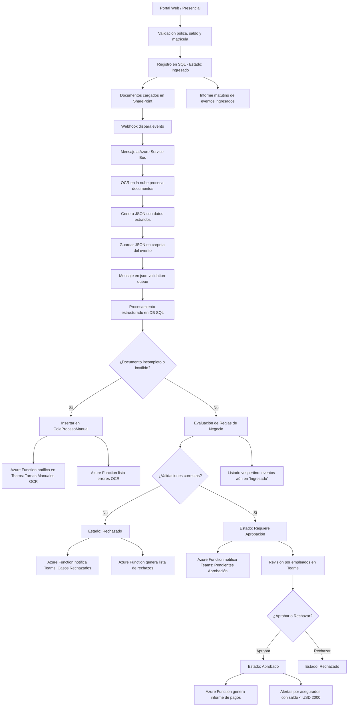
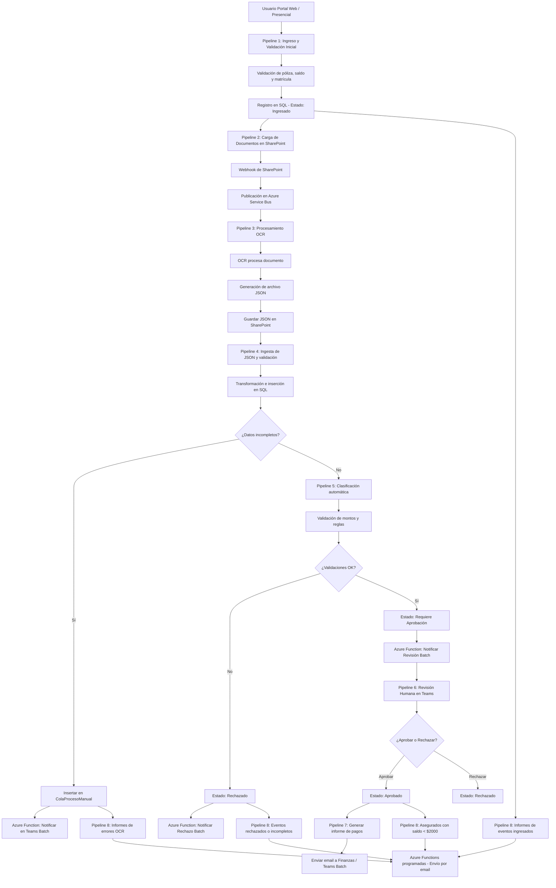

# 🏗️ Arquitectura de Solución

## Diagrama de clases

```mermaid

graph TD

%% Fase I: Ingreso del evento
A1[Portal Web / Presencial] --> A2[Validación póliza, saldo y matrícula]
A2 --> A3[Registro en SQL - Estado: Ingresado]

%% Fase II: Documentación y OCR
A3 --> B1[Documentos cargados en SharePoint]
B1 --> B2[Webhook dispara evento]
B2 --> B3[Mensaje a Azure Service Bus]
B3 --> B4[OCR en la nube procesa documentos]
B4 --> B5[Genera JSON con datos extraídos]
B5 --> B6[Guardar JSON en carpeta del evento]

%% Fase III: Ingesta y clasificación
B6 --> C1[Mensaje en json-validation-queue]
C1 --> C2[Procesamiento estructurado en DB SQL]
C2 --> C3{¿Documento incompleto o inválido?}
C3 -- Sí --> C4[Insertar en ColaProcesoManual]
C4 --> C5[Azure Function notifica en Teams: Tareas Manuales OCR]
C3 -- No --> D1[Evaluación de Reglas de Negocio]

%% Fase IV: Transición de estado
D1 --> D2{¿Validaciones correctas?}
D2 -- No --> D3[Estado: Rechazado]
D2 -- Sí --> D4[Estado: Requiere Aprobación]
D3 --> D5[Azure Function notifica Teams: Casos Rechazados]
D4 --> D6[Azure Function notifica Teams: Pendientes Aprobación]

%% Fase V: Revisión humana
D4 --> E1[Revisión por empleados en Teams]
E1 --> E2{¿Aprobar o Rechazar?}
E2 -- Aprobar --> E3[Estado: Aprobado]
E2 -- Rechazar --> E4[Estado: Rechazado]

%% Fase VI: Informes y alertas
E3 --> F1[Azure Function genera informe de pagos]
D3 --> F2[Azure Function genera lista de rechazos]
C4 --> F3[Azure Function lista errores OCR]
A3 --> F4[Informe matutino de eventos ingresados]
D1 --> F5[Listado vespertino: eventos aún en 'Ingresado']
E3 --> F6[Alertas por asegurados con saldo < USD 2000]

```

---
## Pipelines

```mermaid

graph TD

%% Pipeline 1: Ingreso y Validación Inicial
A1[Usuario Portal Web / Presencial] --> A2[Pipeline 1: Ingreso y Validación Inicial]
A2 --> A3[Validación de póliza, saldo y matrícula]
A3 --> A4[Registro en SQL - Estado: Ingresado]

%% Pipeline 2: Carga de Documentos y Activación OCR
A4 --> B1[Pipeline 2: Carga de Documentos en SharePoint]
B1 --> B2[Webhook de SharePoint]
B2 --> B3[Publicación en Azure Service Bus]

%% Pipeline 3: Procesamiento OCR
B3 --> C1[Pipeline 3: Procesamiento OCR]
C1 --> C2[OCR procesa documento]
C2 --> C3[Generación de archivo JSON]
C3 --> C4[Guardar JSON en SharePoint]

%% Pipeline 4: Ingesta a SQL y Gestión de Errores OCR
C4 --> D1[Pipeline 4: Ingesta de JSON y validación]
D1 --> D2[Transformación e inserción en SQL]
D2 --> D3{¿Datos incompletos?}
D3 -- Sí --> D4[Insertar en ColaProcesoManual]
D4 --> D5[Azure Function: Notificar en Teams Batch]
D3 -- No --> E1[Pipeline 5: Clasificación automática]

%% Pipeline 5: Clasificación automática y notificaciones
E1 --> E2[Validación de montos y reglas]
E2 --> E3{¿Validaciones OK?}
E3 -- No --> E4[Estado: Rechazado]
E3 -- Sí --> E5[Estado: Requiere Aprobación]
E4 --> E6[Azure Function: Notificar Rechazo Batch]
E5 --> E7[Azure Function: Notificar Revisión Batch]
E7 --> F1[Pipeline 6: Revisión Humana en Teams]

%% Pipeline 6: Revisión humana y resolución
F1 --> F2{¿Aprobar o Rechazar?}
F2 -- Aprobar --> F3[Estado: Aprobado]
F2 -- Rechazar --> F4[Estado: Rechazado]

%% Pipeline 7: Informe de eventos listos para pago
F3 --> G1[Pipeline 7: Generar informe de pagos]
G1 --> G2[Enviar email a Finanzas / Teams Batch]

%% Pipeline 8: Informes periódicos de gestión
A4 --> H1[Pipeline 8: Informes de eventos ingresados]
D4 --> H2[Pipeline 8: Informes de errores OCR]
E4 --> H3[Pipeline 8: Eventos rechazados o incompletos]
F3 --> H4[Pipeline 8: Asegurados con saldo < $2000]
H1 --> H5[Azure Functions programadas - Envío por email]
H2 --> H5
H3 --> H5
H4 --> H5

```
